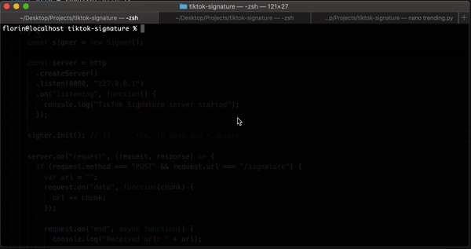

 

## Installation

```bash
npm i tiktok-signature
```

---

## <a href="https://www.buymeacoffee.com/carcabot" target="_blank"></a>

## Usage



### Generating signatures on high performance level

#### Build

```sh
docker build . -t tiktok-signature
```

#### Run

```sh
docker run -p 80:8080 -v $(pwd):/usr/app tiktok-signature
```

## Example

##### Request signature

```
curl -X POST \
     -H "Content-type: application/json" \
     -d 'https://m.tiktok.com/share/item/list?secUid=&id=&type=5&count=30&minCursor=0&maxCursor=0&shareUid=' \
     http://localhost/signature
```

To generate signatures dynamically this repo comes with an integrated http server (listen.js) which accepts POST requests to http://localhost/signature with url in request body.

You have to start the server

```js
npm start
```

### Module

```js
const Signer = require("tiktok-signature"); // Import package

const signer = new Signer(); // Create new signer
await signer.init(); // Create page with. Returns promise

const signature = await signer.sign("tiktok url"); // Get sign for your url. Returns promise
const navigator = await signer.navigator(); // Retrieve navigator data used when signature was generated

console.log(signature);
console.log(navigator);

await signer.close(); // Close browser. Returns promise
```

You can pass your desired User-Agent on class creation.

```js
new Signer("Mozilla"); // Set User-Agent to Mozilla
```

### CLI

Install dependencies

```bash
npm i playwright-chromium
```

Now you can generate the token using

```bash
node browser.js "https://m.tiktok.com/api/post/item_list/?aid=1988&count=30&secUid=MS4wLjABAAAAOUoQXeHglWcq4ca3MwlckxqAe-RIKQ1zlH9NkQkbLAT_h1_6SDc4zyPdAcVdTWZF&cursor=0"
```

The response token should look like this

```json
{
  "status": "ok",
  "data": {
    "signature": "_02B4Z6wo00f01DBbvBwAAIBCcuSZt1Pua8AwS7iAAGyZ6e",
    "verify_fp": "verify_knvz9j2k_miXwiqOy_msam_42g2_BYoa_e4EAbuQnDwqI",
    "signed_url": "https://m.tiktok.com/api/post/item_list/?aid=1988&count=30&secUid=MS4wLjABAAAAOUoQXeHglWcq4ca3MwlckxqAe-RIKQ1zlH9NkQkbLAT_h1_6SDc4zyPdAcVdTWZF&cursor=0&verifyFp=verify_knvz9j2k_miXwiqOy_msam_42g2_BYoa_e4EAbuQnDwqI&_signature=_02B4Z6wo00f01DBbvBwAAIBCcuSZt1Pua8AwS7iAAGyZ6e&X-Bogus=1BLhm+0j/AG2Dlsz3v4u4w==",
    "x-tt-params": "1BLhm+0j/AG2Dlsz3v4u4w==",
    "x-bogus": "1BLhm+0j/AG2Dlsz3v4u4w==",
    "navigator": {
      "width": 884,
      "height": 1244,
      "deviceScaleFactor": 3,
      "user_agent": "Mozilla/5.0 (Windows NT 10.0; Win64; x64) AppleWebKit/537.36 (Windows NT 10.0; Win64; x64) Chrome/90.0.4430.85 Safari/537.36",
      "browser_language": "en-US",
      "browser_platform": "MacIntel",
      "browser_name": "Mozilla",
      "browser_version": "5.0 (Windows NT 10.0; Win64; x64) AppleWebKit/537.36 (Windows NT 10.0; Win64; x64) Chrome/90.0.4430.85 Safari/537.36"
    }
  }
}
```

## Testing

You can test it using trending.py file included in this repo.

```bash
pip install Naked
python examples/trending.py
```

---

**NOTE**

It's very important that the userAgent be the same when generate and when request for response.

Keeping a process too much time opened can increase memory usage, to avoid this uncomment the following lines in `listen.js`.

```js
// setTimeout(function () {
//   server.close(() => {
//     console.log("Server shutdown completed.");
//     process.exit(1);
//   });
// }, 1 * 60 * 60 * 1000);
```

---

## <a href="https://www.buymeacoffee.com/carcabot" target="_blank"></a>

## Contributing

Bug reports and pull requests are welcome on GitHub at https://github.com/carcabot/tiktok-signature.

1. Fork it (<https://github.com/carcabot/tiktok-signature/fork>)
2. Create your feature branch (`git checkout -b my-new-feature`)
3. Commit your changes (`git commit -am 'Add some new feature'`)
4. Push to the branch (`git push origin my-new-feature`)
5. Create a new Pull Request

## License

The lib is available as open source under the terms of the [MIT License](https://opensource.org/licenses/MIT).
